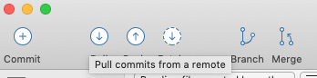
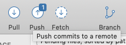
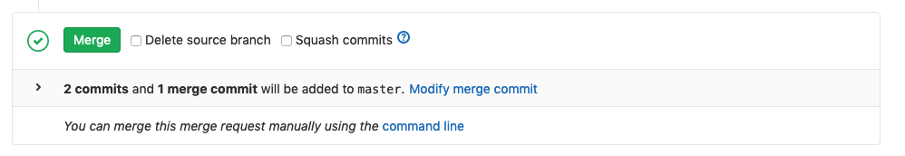

<!-- .slide: data-background-image="images/background.png" -->
# Git
* What is Git?
* Why use it?
* How do we use it?

<!-- .slide: data-background-image="images/background.png" -->
## What is Git?
* Source control
* Version Control
* Distributed

<!-- .slide: data-background-image="images/background.png" -->
### Source Control
* A central place to keep project work
* Data cannot be lost from accidents or server failure

<!-- .slide: data-background-image="images/background.png" -->
### Version Control
* Tracks different versions across time
* Work is not lost when modified or deleted
* No need to keep copies of old code for reference or to restore
* Can retrieve work from any previous point in time
* Can see who changed what and when

<!-- .slide: data-background-image="images/background.png" -->
### Distributed
* Allows people to share work
* Multiple people can work on the same file without disrupting eachother
* Automatically combines changes to the same file
* Helps manage conflicts when changing the same text

<!-- .slide: data-background-image="images/background.png" -->
### Git, Github, Gitlab & Bitbucket
* Git is the version control system
* Github, Gitlab and Bitbucket are popular Git services
* Because they all use Git they process to use them is the same

<!-- .slide: data-background-image="images/background.png" -->
## Why use it?
* Protect from data loss
* Identify owners of work
* Assist with change control
* Can connect to integration tools

<!-- .slide: data-background-image="images/background.png" -->
### Protect from data loss
* Without versioning it is easy to overwrite changes
	* Can restore content that has been overwritten
* Ensures there is a single authoritive version of a project
	* Easy to restore a whole project in a server failure

<!-- .slide: data-background-image="images/background.png" -->
### Identify work owners
* Each change is associated with a user account
* Easy to find who to talk to if clarification is required
* Changes are tagged with a comment that can explain what changed and why

<!-- .slide: data-background-image="images/background.png" -->
### Assist with change control
* Can faciliate testing, review and approval workflow for changes
* Changes can be made in a seperate _branch_
* Can be accepted after review, testing and approval
* With a good workflow most errors can be filtered out

<!-- .slide: data-background-image="images/background.png" -->
### Connect to integration tools
* Most integration tools are build to use git
* We use git to automatically deploy code to a test environment
* We also use it to manually deploy to production
* Human's don't need to touch the server which reduces the risk of mistakes

<!-- .slide: data-background-image="images/background.png" -->
## Integration and automatic deployment
* Platforms like gitlab have powerful integration platforms
* We can easily automate tasks like deployment
* This has a number of advantages
	* Reduce human error when deploying
	* Approvers can deploy with little technical knowledge
	* Keep a record of previous deployments

<!-- .slide: data-background-image="images/background.png" -->
### View Pipelines
* To view the current integration pipelines select _CI/CD_ -> _Pipelines_

<!-- .slide: data-background-image="images/background.png" -->
* This shows the current pipelines
* Successful tasks are shown with a tick, failures with a cross and progress is shown with a pie graph
* Here we can see an automatic deployment has completed successfully

<!-- .slide: data-background-image="images/background.png" -->
* If the repository has manual tasks configured you can click the play button and select the task to run
* Here we can see a task to manually deploy to test
* After clicking deploy_test_manual the task will be deployed to the test server
* You can view detailed task output by clicking the tick, cross or progress icon

<!-- .slide: data-background-image="images/background.png" -->
### Create new integrations
* Integrations are created in the .gitlab-ci.yml file
* They use a specific format to gitlab
* It should be trivial for a developer to setup a new integration

<!-- .slide: data-background-image="images/background.png" -->
## How do we use Git?
* Tools
* Cloning a project
* Pulling code
* Committing work
* Branching
* Merging

<!-- .slide: data-background-image="images/background.png" -->
### Tools
* Lots of Git tools
	* Github Desktop
	* Sourcetree
	* GitKraken
	* Command line
	* Many more

<!-- .slide: data-background-image="images/background.png" -->
### Clone a project
* To download a project from the server you first _clone_ it
* Copy URL from repository
* Select clone in your client
* Enter URL and where you want to save it to
* Lets do this in [Sourcetree](https://www.sourcetreeapp.com/)

<!-- .slide: data-background-image="images/background.png" -->
#### Sourcetree
* A friendly Git client from Atlassian
* You need to setup an Atlassian account to use it
* Select cancel when it asks you to link a Bitbucket or Github account

<!-- .slide: data-background-image="images/background.png" -->
#### Copy URL from repository
* Select _clone_ in repository webpage
* Copy HTTPS URL

<!-- .slide: data-background-image="images/background.png" -->
#### Select clone in Sourcetree
* Select _+ New Repository_
* Select _Clone from URL_

<!-- .slide: data-background-image="images/background.png" -->
#### Paste URL and select target folder
* Paste the HTTPS URL you copied earlier in _Source URL_
* Select target directory in _Destination Path_
* Click clone

<!-- .slide: data-background-image="images/background.png" -->
#### Login
* Enter your login details when prompted

<!-- .slide: data-background-image="images/background.png" -->
#### Open the directory
* You now have the project files on your computer
* Open the directory in finder to access them

<!-- .slide: data-background-image="images/background.png" -->
### Get newest updates with _pull_
* You can download the latest changes by _pulling_ from the repository
* Select the pull button in Sourcetree

<!-- .slide: data-background-image="images/background.png" -->
#### Pull options
* You can usually accept the default options when pulling
* Click OK

<!-- .slide: data-background-image="images/background.png" -->
#### Your project is up to date!
* Any changes will be automatically applied to your files

<!-- .slide: data-background-image="images/background.png" -->
### Commit your changes
* We save out work by _comitting_ it
* We first stage (select) the files we want to commit
* Select the checkboxes for any files you want to commit in _Unstaged files_
* You can select all changed files with the top checkbox

<!-- .slide: data-background-image="images/background.png" -->
* Files you have selected appear in the staged files box

<!-- .slide: data-background-image="images/background.png" -->
#### Enter a commit message
* Enter a description of your changes in the _Commit Message_ textarea at the bottom
* The message should be a short (single sentance) description of what you have changed
* Click commit when you are finished to save your commit

<!-- .slide: data-background-image="images/background.png" -->
* If you want to include additional information in the message you can write a longer message two lines below your main message
* This helps make it easy to browse the commit history later

<!-- .slide: data-background-image="images/background.png" -->
#### Push your changes to the server
* After commiting your changes are saved but are still only on your computer
* The push button shows how many changes you have waiting to send to the server
* Click push to send your changes to the server

<!-- .slide: data-background-image="images/background.png" -->
* The default push options should be fine
* Click _OK_ to push your changes to the server

<!-- .slide: data-background-image="images/background.png" -->
* Now your work has been updated on the server
* You can see a history of the commits to the project by selecting _Commits_ on the repository web page

<!-- .slide: data-background-image="images/background.png" -->
### Branches
* Branches provide a way to save work without affecting other users
* Great for large changes that require many commits
* Allows us to setup workflows for testing, review and approval
	* Makes it difficult for errors to enter the main project

<!-- .slide: data-background-image="images/background.png" -->
#### What is a branch
* A normal repository is a chain of commits
	* A branch is another chain that forks (or branches) off from the main project
* A repository can have many branches
* The main branch called *master* is created automatically
* Branches can be merged back into one another

<!-- .slide: data-background-image="images/background.png" -->

_"Git Branches" by [Atlassian](https://www.atlassian.com/git/tutorials/comparing-workflows/gitflow-workflow) under [CC BY 2.5 Australia](https://creativecommons.org/licenses/by/2.5/au/); dimension attributes added, from [Atlassian](https://www.atlassian.com/git/tutorials/comparing-workflows/gitflow-workflow)_

<!-- .slide: data-background-image="images/background.png" -->
#### Create a new branch
* To create a new branch select the _branch_ button in Sourcetree

<!-- .slide: data-background-image="images/background.png" -->
* Enter the name of your new branch in _New Branch_
* You can choose where to create your code from in _Current Branch_
* Click _Create Branch_ to create your new branch

<!-- .slide: data-background-image="images/background.png" -->
* Your new branch will appear in the list on the right

<!-- .slide: data-background-image="images/background.png" -->
* You can select a branch for additional details
* Select _File status_ to return to the file view

<!-- .slide: data-background-image="images/background.png" -->
* When you push your changes you can select which branches you want to push
* When in doubt check _Select All_

<!-- .slide: data-background-image="images/background.png" -->
### Merge a branch back to master
* After a branch is finished you can merge it back into the master branch
* The best way to do this is with a _Merge request_
* A merge request allows another person to review the changes before they are applied

<!-- .slide: data-background-image="images/background.png" -->
* To create a merge request open the repository in gitlab and select _Repository_ -> _Branhes_

<!-- .slide: data-background-image="images/background.png" -->
* All _pushed_ branches will appear in the list
* Click _Merge Request_ to create a new request

<!-- .slide: data-background-image="images/background.png" -->
* Review the merge request title
* Enter a description if required
* Click _Submit Merge Request_ to save

<!-- .slide: data-background-image="images/background.png" -->
#### Complete a merge request
* If there are no conflicts you can click _Merge_ to complete the change
* If there are conflicting changes between the two branches you can select _Resolve Conflicts_ to review the changes

<!-- .slide: data-background-image="images/background.png" -->

<!-- .slide: data-background-image="images/background.png" -->
#### Resolve merge conflicts
* The resolve conflicts menu allows you to select which changes you want to keep
	* Select _Use ours_ or _Use theirs_ to select one changes and discard the other
* If you want more fine control you can select _Edit inline_ to manually edit the file

<!-- .slide: data-background-image="images/background.png" -->

<!-- .slide: data-background-image="images/background.png" -->
* Once the conflicts are resolved you can select _Merge_
* Your changes will be applied to the target branch

<!-- .slide: data-background-image="images/background.png" -->
## Additional Resources
* Git Clients
	* [Sourcetree](https://www.sourcetreeapp.com/)
	* [GitKraken](https://www.gitkraken.com/)
	* [GitHub Desktop](https://desktop.github.com/)
* Using Git
	* [Learning Git](https://www.atlassian.com/git/tutorials/learn-git-with-bitbucket-cloud)
	* [What is version control](https://www.atlassian.com/git/tutorials/what-is-version-control)
	* [Git branches](https://www.atlassian.com/git/tutorials/using-branches)
	* [Git Workflows](https://www.atlassian.com/git/tutorials/comparing-workflows/gitflow-workflow)
