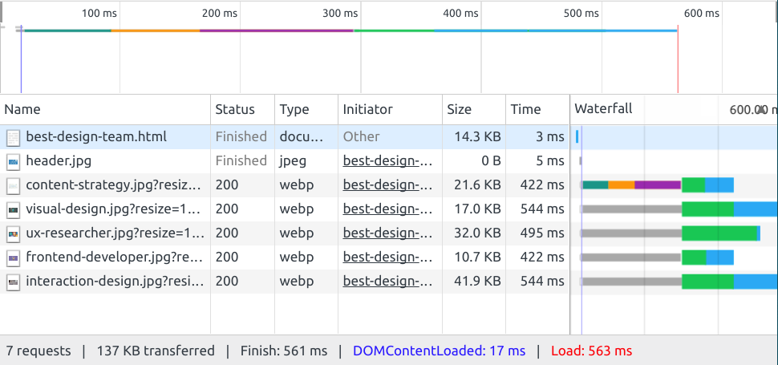
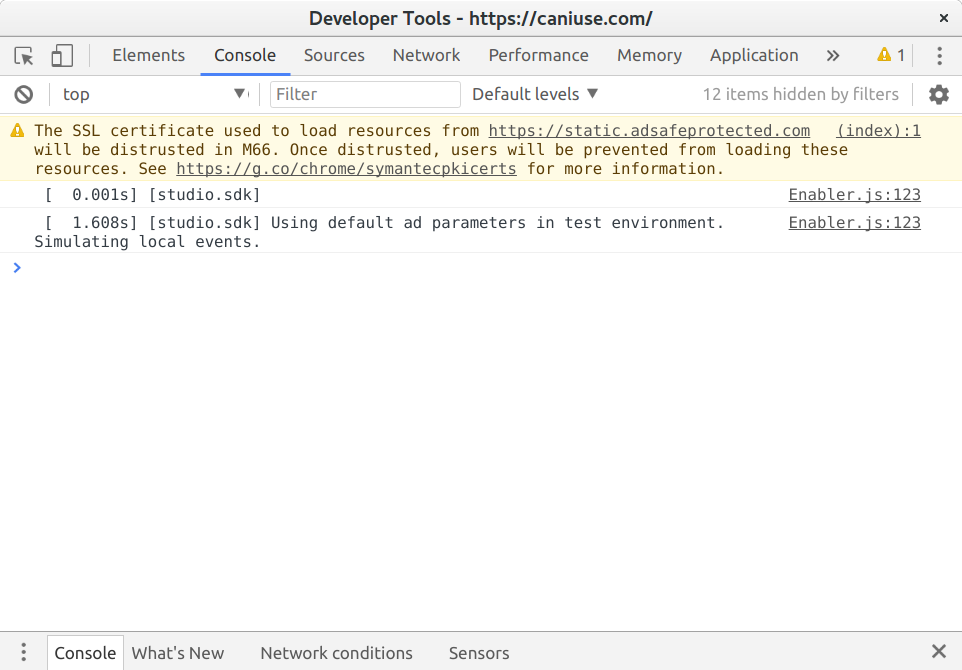

<!-- .slide: data-background-image="images/bg-mouse.jpg" -->
# Skill Up: Code

<!-- .slide: data-background-image="images/bg-mouse.jpg" -->
## Browser and development tools

<!-- .slide: data-background-image="images/bg-mouse.jpg" -->
Plenty of good brower choices

 <!-- .element: class="browser-icon" -->
 <!-- .element: class="browser-icon" -->
 <!-- .element: class="browser-icon" -->

Note:
As you’re likely aware the different major browsers have some differences in the features they support and performance. Everyone has their own preferences and so in the workplace we need to test with all the major browsers. 

<!-- .slide: data-background-image="images/bg-mouse.jpg" -->
We're going to use chrome

 <!-- .element: class="browser-icon browser-icon_disabled" -->
 <!-- .element: class="browser-icon browser-icon_selected" -->
 <!-- .element: class="browser-icon browser-icon_disabled" -->

* Modern feature set <!-- .element: class="fragment" data-fragment-index="1" -->
* Great development tools <!-- .element: class="fragment" data-fragment-index="1" -->

Note:
To make things simple, we’re just going to use Chrome for this class. Chrome has a very modern feature set and great development tools that will make our work much easier. Let’s get to know the features.

<!-- .slide: data-background-image="images/bg-mouse.jpg" -->
### Chrome Developer tools: DOM Inspector
<video>
	<source data-src="videos/open-dev-tools.webm" type="video/webm" />
</video>

Note:
Click the elements tab and look at the contents. It should look just like HTML you wrote for the exercise. This is not the same as the source code though as it represents the elements currently on the page. If you used javascript to add or remove an element it would appear here. This is a representation of the Document Object Model or DOM. You can just think of the DOM as how the browser keeps track of what’s on the page.

<!-- .slide: data-background-image="images/bg-mouse.jpg" -->
### Chrome Developer tools: DOM Inspector
<video>
	<source data-src="videos/dev-tools-elements.webm" type="video/webm" />
</video>

Note:
Expand the page elements if they are not already by clicking on the little arrows. Notice how the view of your page highlights the element you are currently hovering over? This makes it easy to see where the element sits as well as any padding, margins or borders. On the right you can see the CSS for the element. 

<!-- .slide: data-background-image="images/bg-mouse.jpg" -->
### Chrome Developer tools: DOM Inspector
<video>
	<source data-src="videos/dev-tools-edit-style.webm" type="video/webm" />
</video>

<!-- .slide: data-background-image="images/bg-mouse.jpg" -->
### Chrome Developer tools: DOM Inspector
* Explore your dom
* Give some elements a border to see where they sit
	<pre><code class="css">border: 1px solid black;</code></pre>
* Drag some elements in to others
* Can you edit the text of a heading?
* What happens when you refresh? Why?

<!-- .slide: data-background-image="images/bg-mouse.jpg" -->
### Chrome Developer tools: Network
* View all HTTP requests the page makes <!-- .element: class="fragment" data-fragment-index="1" -->
* View files downloaded <!-- .element: class="fragment" data-fragment-index="2" -->
* View REST requests and responses <!-- .element: class="fragment" data-fragment-index="3" -->

<!-- .slide: data-background-image="images/bg-mouse.jpg" -->
### Chrome Developer tools: Network
<video>
	<source data-src="videos/dev-tools-network.webm" type="video/webm" />
</video>

<!-- .slide: data-background-image="images/bg-mouse.jpg" -->
### Chrome Developer tools: Network

Note:
Open the network tab and reload the page. You will see a list of files appear. Each of these is a seperate HTTP request. They include the original HTML document as well as any images, stylesheets or scripts the page requires. You can also see when the page requests more data from a server.

<!-- .slide: data-background-image="images/bg-mouse.jpg" -->
### Chrome Developer tools: Network timeline 

Note:
The timeline shows when it loaded different resources and how long they took. If you have a really big script or image that is making everything slow to load you can see it here.

<!-- .slide: data-background-image="images/bg-mouse.jpg" -->
### Chrome Developer tools: Network requests

Note:
The timeline shows when it loaded different resources and how long they took. If you have a really big script or image that is making everything slow to load you can see it here. It will show you the file requested, the response code, what initiated the request, how big the file is and how long it took to download.

<!-- .slide: data-background-image="images/bg-mouse.jpg" -->
### Chrome Developer tools: Network details

Note:
The bottom panel tells you how big the page is and how long it took to download and load. What do you are the difference between Finish, DOMContentLoaded and Load?

<!-- .slide: data-background-image="images/bg-mouse.jpg" -->
### Chrome Developer tools: Web console

Note:
The console is where any page errors or javascript output appear. There probably isn't much for your pages. But this is really useful once you start using javascript. We'll come back to this later in the course.

<!-- .slide: data-background-image="images/bg-mouse.jpg" -->
### Chrome Developer tools: Activity
* Open a favourite website with dev tools open
* How big is the page?
* How long did it take to download?
* Did it download a lot of files or not many
* Are there any errors or warnings in the console?
* Have a look through the elements to learn the page structure
* Report back to the class on what you find

<!-- .slide: data-background-image="images/bg-mouse.jpg" -->
### Atom Editor

Note:
For this course we're going to use Atom. There are a lot of different text editors available and lots are people are pretty dedicated to their favourite. If you already have a favourite feel free to use that. But for those getting starting we recommend using atom

<!-- .slide: data-background-image="images/bg-mouse.jpg" -->
### Why use atom
* Cross platform
* Package manager
* Git integration
* Configurable
* Easy to setup and learn
* Cool features
	* Syntax highlighting
	* Smart autocomplete
	* Search and browse project files

Note:
Atom is a cross platform, customisable text editor for coding. It is easy to setup and get started with but lets you complately configure the look and feel using HTML and CSS and to extend the functionality with plugins. It also comes with a lot of useful features out of the box like autocomplete, syntax highlighting and project wide search.
It is also really customisable using web languages. You can change the whole application theming using just CSS! 

<!-- .slide: data-background-image="images/bg-mouse.jpg" -->
<video>
	<source data-src="videos/atom-intro.webm " type="video/webm" />
</video>

<!-- .slide: data-background-image="images/bg-mouse.jpg" -->
### Atom: Activity
* Open atom and add the document you made before class as a project
* Explore atom features
	* Open settings menu (ctl+,)
	* Explore features in the command palette (ctl+shift+p)
	* Explore keyboard shortcuts from a list like [https://gist.github.com/chrissimpkins/5bf5686bae86b8129bee](https://gist.github.com/chrissimpkins/5bf5686bae86b8129bee)

<!-- .slide: data-background-image="images/bg-mouse.jpg" -->
Share what you found

<!-- .slide: data-background-image="images/bg-mouse.jpg" -->
### Atom plugins
* Open the settings menu (ctl+,) and select install
* Type in devdocs and install the package
* Now go to your html document and select a tag name
* Press ctl+alt+D to open the documentation for that tag from [https://devdocs.io](devdocs.io)

