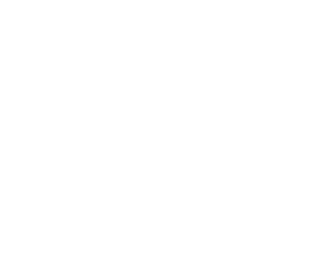
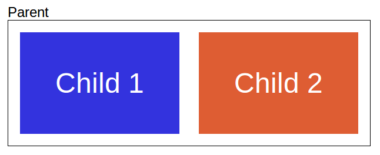

<!-- .slide: data-background-image="images/bg-mouse.jpg" -->
# <span>Skill Up:</span> <span>Code</span>


<!-- .slide: data-background-image="images/bg-mouse.jpg" -->
## What did you learn last week?
Without talking write down the top thing you learned last week


<!-- .slide: data-background-image="images/bg-mouse.jpg" -->
## Accessibility


<!-- .slide: data-background-image="images/bg-mouse.jpg" -->
### Tables
* Present tabular data
* Easy to scan by column or row
* Must be properly marked up for screen readers and other tools
* &lt;caption&gt; immediatly after &lt;table&gt;
* Headers should be marked `scope="col"` or `scope="row"`

Note:
Data tables are used to present tabular data. They are easy to sighted users to scan by column or row. They must be clearly marked up for tools like screen readers to read them properly. 
Captions are added immediately after the table is opened
Headers should be marked with scole=”col” or scope=”row”. This makes it clear if the header is for the row or column. 


<!-- .slide: data-background-image="images/bg-mouse.jpg" -->
```html
<table>
<caption>2018 Oscar Winders</caption>

<tr>
<th scope="col">Name</th>
<th scope="col">Category</th>
<th scope="col">Director</th>
</tr>

<tr>
<th scope="row">Guillermo del Toro</th>
<td>Best Picture</td>
<td>The Shape of Water</td>
</tr>

<tr>
<th scope="row">Get Out</th>
<td>Best original screenplay</td>
<td>Jordan Peele</td>
</tr>

</table>
```


<!-- .slide: data-background-image="images/bg-mouse.jpg" -->
### Forms
* Logical order
* Test with tab navigation
* Break large forms into groups with &lt;fieldset&gt;
* Input should always have a label
* Do not use placeholder instead of a label

Note:
Forms should be structured in a logical order. It is alright to change the order a little with styling (e.g. right to left or columns) but it should still be immediately intuitive which way the form flows. Try using tab to navigate the form to ensure it makes sense. Large forms should be broken into logical group using fieldsets. 
All inputs should have a label correctly attached using the for attribute. NEVER use placeholder instead of a label. Placeholder should be used to provide examples of expected input if the format is unclear.


<!-- .slide: data-background-image="images/bg-mouse.jpg" -->
### Colour contrast
* Vision problems are incredibly common
* Red/green colour blindness affects ~8% of Northern European Men
* Strong contrast important for everyone

Note:
How many people wear glasses here?
Red green colour blindness affect 8% of Northern European Men (https://nei.nih.gov/health/color_blindness/facts_about) although it varies by ethnicity. 
Only around 1 in 100- eskimos are colour blind (http://www.colour-blindness.com/general/prevalence/)
Blue colour blindness is less common.
Strong contrast is not just for colourblind people though. It is hard for everyone to read with poor contrast and especially hard for people with failing vision.


<!-- .slide: data-background-image="images/bg-mouse.jpg" -->
 <!-- .element: class="screenshot-small" -->
 <!-- .element: class="screenshot-small fragment" data-fragment-index="1" -->
 <!-- .element: class="screenshot-small fragment" data-fragment-index="1" -->
 <!-- .element: class="screenshot-small fragment" data-fragment-index="1" -->
 <!-- .element: class="screenshot-small fragment" data-fragment-index="1" -->
 <!-- .element: class="screenshot-small fragment" data-fragment-index="1" -->


<!-- .slide: data-background-image="images/bg-mouse.jpg" -->

* How many people need glasses? <!-- .element class="fragment" data-fragment-index="1" -->


<!-- .slide: data-background-image="images/bg-mouse.jpg" -->
### Activity: Fix the contrast
* Download template from learnline
* Fix colour contrast
	* Check using online tools
	* http://leaverou.github.io/contrast-ratio/


<!-- .slide: data-background-image="images/bg-mouse.jpg" -->
### Keyboard Navigation
* Must be possible to navigate without a mouse
* Try using tab
* Focus must be visible. Do not remove :focus styling
* Use correct elements to get default focus
* Can change focus with tabindex but be careful

Note:
Many users with mobility difficulties need to navigate without a mouse. You should be able to tab through the key elements of a page. It is also important to make it clear which elements are focused. 
Tabindex allows you to change tab focus. It can be useful but it is easy to screw up. It’s better to use the correct elements where possible.
:focus can help you show when an element is focused. You should not remove the browser default unless you are making it clearer.


<!-- .slide: data-background-image="images/bg-mouse.jpg" -->
### Media
* Videos should have subtitles
* Audio should have transcripts

Note:
Videos should have subtitles. Youtube offers same great predictive tools that help you get started making subtitles. Audio content should have a text transcript available.


<!-- .slide: data-background-image="images/bg-mouse.jpg" -->
### Images
* Use the alt tag!!!!!
* If the image doesn't add content use CSS
* Can caption diagrams using &lt;figure&gt; and &lt;figcaption&gt;

Note:
All content images require an alt tag to describe the image. If the image is not content it is usually better to include it using CSS. You can add captions using figure and figcaption. We'll talk about them later.


<!-- .slide: data-background-image="images/bg-mouse.jpg" -->
<iframe width="560" height="315" src="https://www.youtube.com/embed/q_ATY9gimOM" frameborder="0" allow="autoplay; encrypted-media" allowfullscreen></iframe>


<!-- .slide: data-background-image="images/bg-mouse.jpg" -->
## Structural elements

Note:
We talked last week about why semantic HTML is important. There are a lot of different elements. Lets have a look at a few. Don’t worry if you don’t remember them all, you can always come back to look later. 


<!-- .slide: data-background-image="images/bg-mouse.jpg" -->
### Headings

* 6 heading levels
	* &lt;h1&gt; ... &lt;h6&gt;
* Should be used in order
	* Do not skip heading types
* Usually only one h1 per page

Note:
HTML has 6 heading levels. H1 - h6 and should be used in order. A document should have exactly one h1 element and each heading should fall under the heading above it. Some guides say you shouldn't use anything more than h3 or h4, the headings exist for a reason and it is fine to use them but it might be a clue that your content is too complicated


<!-- .slide: data-background-image="images/bg-mouse.jpg" -->
### &lt;nav&gt;
* Contains navigation links

Note:
Nav indicates that it contains navigation links. In your exercises last week quite a few people used nav elements which was really good to see. Please note that is is not a list element and may not have list items as direct children. It may however contain an ordered or more often, an unordered list.


<!-- .slide: data-background-image="images/bg-mouse.jpg" -->
### &lt;figure&gt; and &lt;figcaption&gt;
* Image, diagram, graph, code snippet, etc...
* Self contained
* Use &lt;figcaption&gt; to add captions or legends

Note:
A figure is usually an image, diagram, graph, code snippet or similar. It should be self-contained and make sense without the surrounding content. Figcaption contains a caption or legend for the parent figure.


<!-- .slide: data-background-image="images/bg-mouse.jpg" -->
### &lt;aside&gt;
* Only indirectly related to surrounding content
* Or related to core content but not part of the core content
* Like a sidebar or those sub-articles you sometimes see in a magazine


<!-- .slide: data-background-image="images/bg-mouse.jpg" -->
### &lt;article&gt;
* Self contained content
* Would make sense without the rest of the page
* Should have a heading
* Can be nested
	* e.g. article for blog post and articles for comments

Note:
A self-contained item of content. It should generally have a heading. If you pulled an article out and put it on another page it should still make sense. Examples are blog posts, user comments or even items in an image gallery if they don’t need context. 


<!-- .slide: data-background-image="images/bg-mouse.jpg" -->
### &lt;section&gt;
* Content that depends on the parent for context
* Would not make sense without surrounding content
* Should have a heading

Note:
An item of content that depends on the surrounding content for context. If you pulled a section out and put it elsewhere it would not make sense. A section should also generally have a heading. 


<!-- .slide: data-background-image="images/bg-mouse.jpg" -->
### &lt;p&gt;
* Text paragraph

Note:
The paragraph tag should be used for all text paragraphs. This is preferable to a div as it is clear it contains a paragraph of text.


<!-- .slide: data-background-image="images/bg-mouse.jpg" -->
### &lt;div&gt; and &lt;span&gt;
* Use for styling
* Has no impact on content structure

Note:
If a tag is needed for styling but should not have an impact on the structure of the context you should use a div or a span tag. 


<!-- .slide: data-background-image="images/bg-mouse.jpg" -->
### &lt;input&gt;
* Not really structural
* Lots of new types with HTML5
	* email
	* date
	* number

Note:
Not really a structural element. But worth mentioning all the same. You are likely familiar with the input element. However HTML added a lot more types that give forms more semantic context. Instead of just text, radio, password, hidden, etc… We now have input types like email, date, number and tel. Note that these do not all give you a special input form but help advise the user’s browser what type of input is expected. For example tel is considered too complicated for browsers to validate but may prompt a mobile browser to first show a numeric keyboard.


<!-- .slide: data-background-image="images/bg-mouse.jpg" -->
### Activity: Write the markup
* [The importance of sections](https://www.smashingmagazine.com/2013/01/the-importance-of-sections/?_ga=2.72253905.354623181.1520469113-698638064.1518098509)
* [Content](https://online.cdu.edu.au/bbcswebdav/pid-2569075-dt-content-rid-8647604_2/xid-8647604_2)


<!-- .slide: data-background-image="images/bg-mouse.jpg" -->
## Document Object Model


<!-- .slide: data-background-image="images/bg-mouse.jpg" -->
### What is the DOM?
* Not HTML
* What you see in dev tools
* Browser representation of the document and elements
* Can be modified after page load

Note:
M is not the HTML you write or get from view source. But that is used to create it.
The DOM is what you see in dev tools. It looks like HTML but that’s just a way to represent it.
The DOM is the browser representation of the document and the elements that make it up. The main difference between the DOM and your HTML is that the DOM can be manipulated after the page has loaded. We’ll go into that when we get to javascript. For now, let’s talk about the structure


<!-- .slide: data-background-image="images/bg-mouse.jpg" -->
### Parents, Children and Siblings


Note:
When we “walk” or traverse the DOM we walk down to the “children” of an element, across to the “siblings” and up to the “parents”. We also use these terms when we talk about CSS selectors so it is worth understanding the terminology.


<!-- .slide: data-background-image="images/bg-mouse.jpg" -->
* Common terminology
	* "walk up" to parents
	* "walk down" to children
	* "walk across" to siblings


<!-- .slide: data-background-image="images/bg-mouse.jpg" -->
## Tree structure

<p class="attribution">By Birger Eriksson (Own work) [<a href="https://creativecommons.org/licenses/by-sa/3.0">CC BY-SA 3.0</a>], via Wikimedia Commons</a>

Note:
These parent relationships make for an intuitive tree structure. You can think of the DOM as a tree of nodes, with document as the root node.Under document you would find html which would have the body and head nodes branching off it. Lets draw this code as a DOM tree


<!-- .slide: data-background-image="images/bg-mouse.jpg" -->
* A tree of nodes
* Document is the root node
* html under document
* body under html


<!-- .slide: data-background-image="images/bg-mouse.jpg" -->
### Activity: Draw the tree
```
<html>
	<head>
		<title>My page</title>
	</head>
	<body>
		<main>
			<article>
				<h2>My article</h2>
				<section>
					<h2>My section</h2>
					<p>My text</p>
				</section>
			</article>
		</main>
	</body>
</html>
```


<!-- .slide: data-background-image="images/bg-mouse.jpg" -->
### Rendered

* Children usually appear inside their parents
* Like boxes in boxes

Note:
As a general rule (with lots of exceptions) each element should appear inside the parent. Yes, it is easy to make it appear outside with CSS but the are usually logically nested as content. You could think of them as boxes inside boxes. So this DOM tree will look like this


<!-- .slide: data-background-image="images/bg-mouse.jpg" -->
### Draw the page
```
<html>
	<head>
		<title>My page</title>
	</head>
	<body>
		<main>
			<article>
				<h2>My article</h2>
				<section>
					<h2>My section</h2>
					<p>My text</p>
				</section>
			</article>
		</main>
	</body>
</html>
```

Note::
It’s hard work to make a page if you just use trial and error. Fortunately the DOM renders pretty intuitively. Have a look at this page and try to draw it it groups of threes. Talk about why you think it works. We’ll bring some up to look at when you finish.


<!-- .slide: data-background-image="images/bg-mouse.jpg" -->
## CSS


