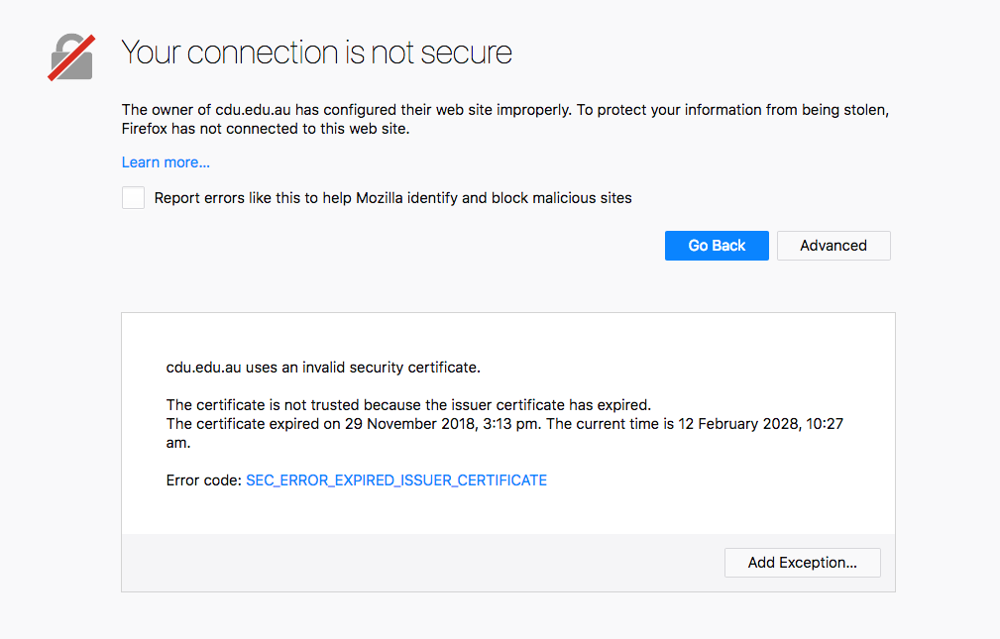
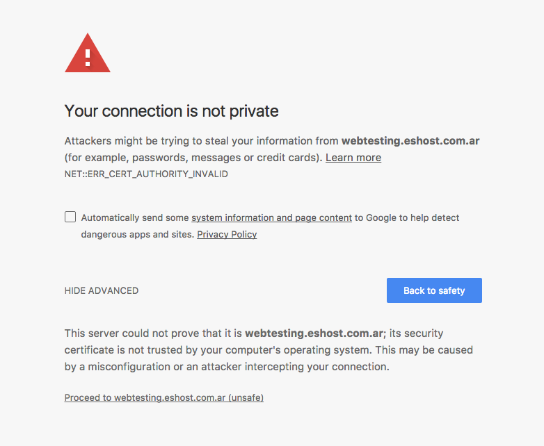
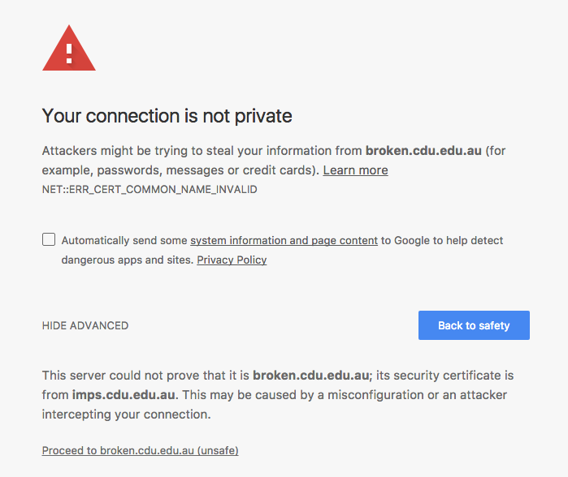

<!-- .slide: data-background-image="images/lego-568042_1280.jpg" -->
# HTTPS
## What is HTTP and why does it matter

<a href="https://pixabay.com/en/lego-males-axe-toys-legomaennchen-568042/" target="_blank">"Lego axe"</a> by <a href="https://pixabay.com/en/users/blickpixel-52945/" target="_blank">blickpixel</a> is in the <a href="http://creativecommons.org/publicdomain/zero/1.0/" target="_blank">Public Domain, CC0</a>

<!-- .slide: data-background-image="images/lego-postman.jpg" -->
### HTTP
 <!-- .element: class="fragment" data-fragment-index="1" -->

<a href="https://www.flickr.com/photos/stavos52093/12361203415" target="_blank">"Post Officer"</a> by <a href="https://www.flickr.com/photos/stavos52093/" target="_blank"> stavos</a> is licensed under <a href="http://creativecommons.org/licenses/by-nc-nd/4.0" target="_blank">CC BY-NC-ND 4.0</a>

Note:
* Traffic is sent from the user to the server in plaintext
* This means the traffic can be read by anyone along the wire
* The URLs you visit, the page content and everything you enter can be read
* This includes usernames and passwords

<!-- .slide: data-background-image="images/lego-guarded.jpg" -->
### HTTPS
 <!-- .element: class="fragment" data-fragment-index="1" -->

<a href="https://www.flickr.com/photos/stavos52093/12383314604/in/photostream/" target="_blank">"Special delivery"</a> by <a href="https://www.flickr.com/photos/stavos52093/" target="_blank"> stavos</a> is licensed under <a href="http://creativecommons.org/licenses/by-nc-nd/4.0" target="_blank">CC BY-NC-ND 4.0</a>

Note:
* Traffic is encrypted
* Nobody except the user and the server can read what is sent and received
* important for both privacy and security

<!-- .slide: data-background-image="images/encryption.jpg" -->
### What is encryption

Note:
* Uses SSL (secure socket layer) or TLS (Transport Layer Security)
* These are asymmetric public key infrastructure (PKI) encryption
* Use two keys to encrypt
 * public key can only be decrypted by private key
 * private key can only be decrypted by public key
* We can use this to ensure only the correct recipient recieves our message
* It also can ensure that we know who the message came from. I can't pretend to be facebook

<!-- .slide: data-background-image="images/lego-keys.png" -->
### HTTPS Certificates

Note:
* This is what the website sends you to encrypt traffic
* Issued for a single domain (or wildcard)
	* Works for all paths under that domain
* contains the server's public key
* We use the public key to create a shared secret key
* it should be signed (created) by a trusted authority
	* Depending on authority it costs about $30 USD a year
	* The university has unlimited certificates so free for CDU domains
	* $5 options are fine for your personal website

<!-- .slide: data-background-image="images/green-bricks.jpg" -->
### What's the deal with the green bar?

Note:
* Not all certificates are equal
* Extended Validation (EV) certificates have a greater identity validation process
* The address bar turns green and displays the name of the organisation
* Much more expensive. Around $250 a year

<!-- .slide: data-background-image="images/mixed-blocks.jpg" -->
### Mixed Content

<a href="https://www.flickr.com/photos/avlxyz/35435817803" target="_blank">"Green 2x2 brick in a sea of orange 4x2 Lego bricks"</a> by <a href="https://www.flickr.com/photos/avlxyz/" target="_blank">Alpha</a> is licensed under <a href="http://creativecommons.org/licenses/by-nc/4.0" target="_blank">CC BY-NC 4.0</a>

Note:
* The html page itself is secure (https) but it loads insecure resources (http)
* This greatly reduces the privacy provided by https
* The insecure resources could in principle be modified by a third party (man in the middle attack)
* To resolve this load everything from https or exclude the protocol. e.g. //cdu.edu.au

<!-- .slide: data-background-image="https://media.giphy.com/media/l3q2y0UyD0OOMchAA/giphy.gif" -->
### HTTPS Errors

Note:
* Expired certificate (check your date/time - otherwise server is misconfigured)

Note:
* Unknown certififer (maybe self signed or they left out the certificate chain)

Note:
* Wrong domain (server is misconfigured or accessing wrong server)

<!-- .slide: data-background-image="images/Law-Enforcement-Policeman-Lego-Police-1058422.jpg" -->
### Do I need HTTPS for *everything*?

<a href="http://maxpixel.freegreatpicture.com/Law-Enforcement-Policeman-Lego-Police-1058422" target="_blank">"Law Enforcement Policeman Lego Police"</a> by <a href="http://maxpixel.freegreatpicture.com/" target="_blank">Max Pixel</a> is in the <a href="http://creativecommons.org/publicdomain/zero/1.0/" target="_blank">Public Domain, CC0</a>

Note:
* To provide privacy everything needs to be secure
* Google give higher rankings for HTTPS content
* Some new web functionality requires HTTPS
	* Progressive web apps require HTTPS
* Good practice to redirect HTTP traffic to HTTPS

<!-- .slide: data-background-image="images/hand-plastic-finger-macro-yellow-closeup-281276-pxhere.com.jpg" -->
### Questions

<a href="https://pxhere.com/en/photo/281276" target="_blank">"Plastic Hand"</a> by <a href="https://pxhere.com/" target="_blank">PXHere</a> is in the <a href="http://creativecommons.org/publicdomain/zero/1.0/" target="_blank">Public Domain, CC0</a>

