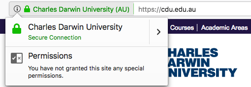

# HTTPS
## What is HTTP and why does it matter

### HTTP

Note:
* Traffic is sent from the user to the server in plaintext
* This means the traffic can be read by anyone along the wire
* The URLs you visit, the page content and everything you enter can be read
* This includes usernames and passwords

### HTTPS

Note:
* Traffic is encrypted
* Nobody except the user and the server can read what is sent and received
* important for both privacy and security

### What is encryption

Note:
* Uses SSL (secure socket layer) or TLS (Transport Layer Security)
* These are asymmetric public key infrastructure (PKI) encryption
* Use two keys to encrypt
 * public key can only be decrypted by private key
 * private key can only be decrypted by public key
* We can use this to ensure only the correct recipient recieves our message
* It also can ensure that we know who the message came from. I can't pretend to be facebook

### HTTPS Certificates

Note:
* This is what the website sends you to encrypt traffic
* Issued for a single domain (or wildcard)
	* Works for all paths under that domain
* contains the server's public key
* We use the public key to create a shared secret key
* it should be signed (created) by a trusted authority
	* Depending on authority it costs about $30 USD a year
	* The university has unlimited certificates so free for CDU domains
	* $5 options are fine for your personal website

### What's the deal with the green bar?

Note:
* Not all certificates are equal
* Extended Validation (EV) certificates have a greater identity validation process
* The address bar turns green and displays the name of the organisation
* Much more expensive. Around $250 a year

### Mixed Content

Note:
* The html page itself is secure (https) but it loads insecure resources (http)
* This greatly reduces the privacy provided by https
* The insecure resources could in principle be modified by a third party (man in the middle attack)
* To resolve this load everything from https or exclude the protocol. e.g. //cdu.edu.au

### HTTPS Errors

Note:
* Common errors include
 * Expired certificate (check your date/time - otherwise server is misconfigured)
 * Unknown certififer (maybe self signed or they left out the certificate chain)
 * Wrong domain (server is misconfigured or accessing wrong server)

### Do I need HTTPS for *everything*?

Note:
* To provide privacy everything needs to be secure
* Google give higher rankings for HTTPS content
* Some new web functionality requires HTTPS
	* Progressive web apps require HTTPS
* Good practice to redirect HTTP traffic to HTTPS

### Questions

