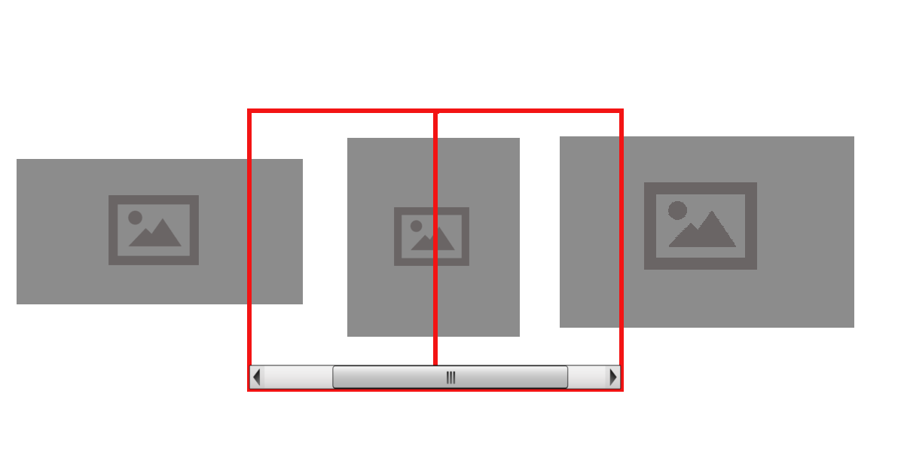
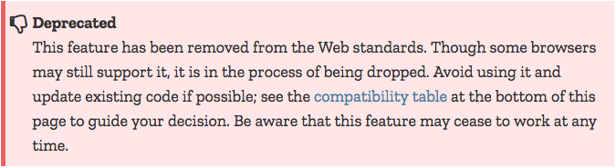
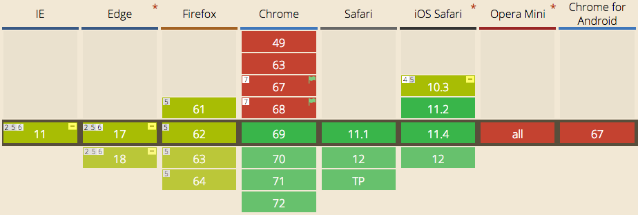
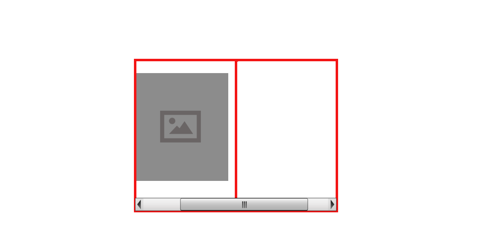
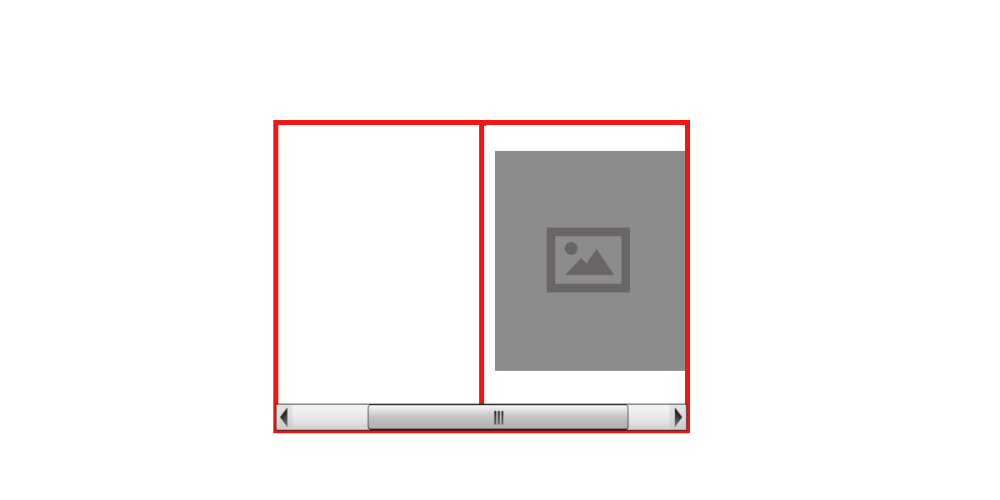
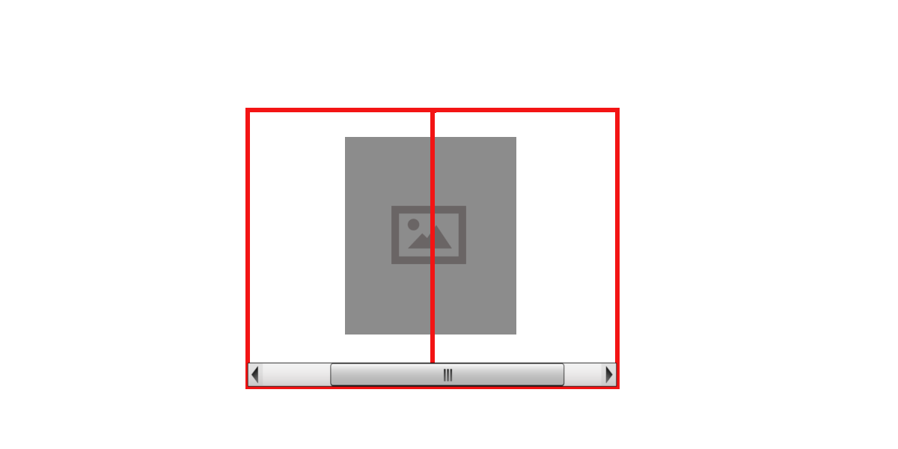
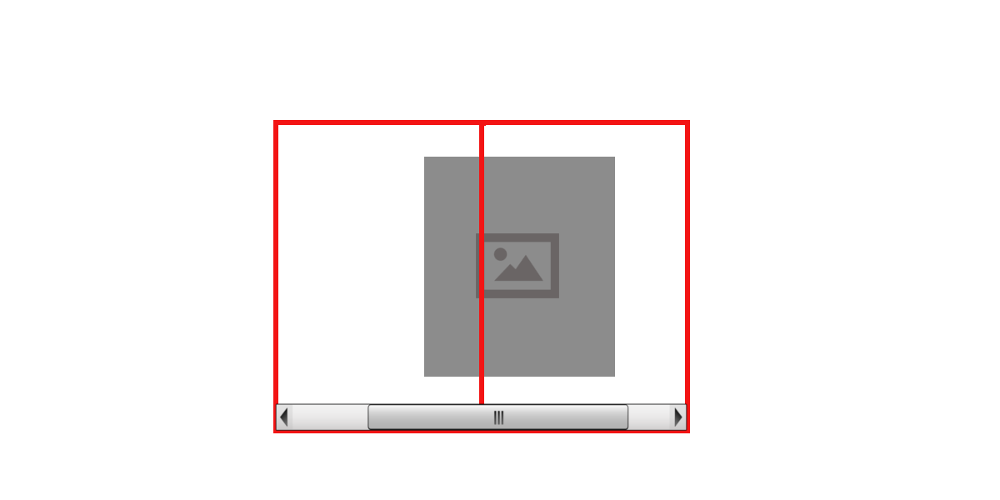
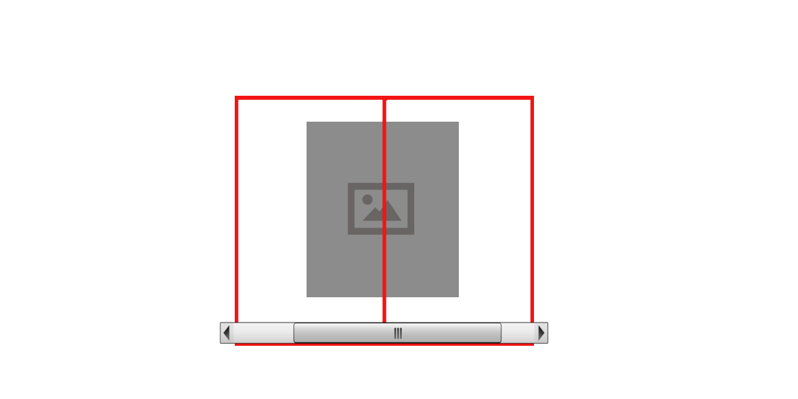
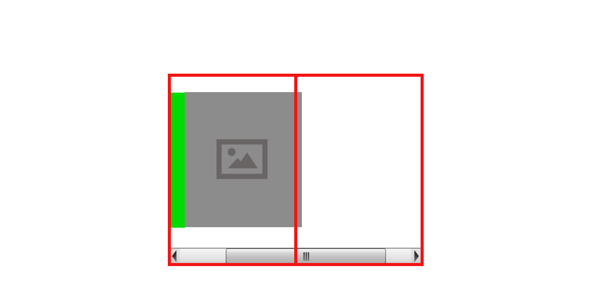

<!-- .slide: data-background-image="images/17063208_a739b50788_o.jpg" -->
<!-- .slide: data-background-image="images/17063208_a739b50788_o.jpg" -->
# Scroll Snap


<!-- .slide: data-background-image="images/17063208_a739b50788_o.jpg" -->
## Snap viewport to a scroll position



<!-- .slide: data-background-image="images/17063208_a739b50788_o.jpg" -->
## What's new?


<!-- .slide: data-background-image="images/17063208_a739b50788_o.jpg" -->
## [CSS Scroll Snap Points](https://www.w3.org/TR/2015/WD-css-snappoints-1-20150326/)
* introduced in FF 39 & IE 10 then deprecated



<!-- .slide: data-background-image="images/17063208_a739b50788_o.jpg" -->
## [New Element Level CSS Scroll Snap](https://www.w3.org/TR/css-scroll-snap-1/)
* introduced in Safari 11 and last week in Chrome 69



<!-- .slide: data-background-image="images/17063208_a739b50788_o.jpg" -->
* Still only limited support
* Well suited to progressive enhancement


<!-- .slide: data-background-image="images/17063208_a739b50788_o.jpg" -->
## How does it work?
[CSS Scroll Snap Demo](https://codepen.io/elvey/pen/NLXVNj)


<!-- .slide: data-background-image="images/17063208_a739b50788_o.jpg" -->
### Snapport
* Just like a viewport
* But for scroll snapping	<!-- .element class="fragment" data-fragment-index="1" -->
* Defaults to the same size of the viewport	<!-- .element class="fragment" data-fragment-index="2" -->
* Unless you change it	<!-- .element class="fragment" data-fragment-index="3" -->


<!-- .slide: data-background-image="images/17063208_a739b50788_o.jpg" -->
## Two properties to set

```css
.container {
  scroll-snap-type: y mandatory;  
}

.item {
  scroll-snap-align: center;
}
```

Note:
Set scroll-snap-type on the scollable container and scroll-snap-align on the scroll targets


<!-- .slide: data-background-image="images/17063208_a739b50788_o.jpg" -->
## Three types of scroll, two directions
```css
scroll-snap-type: [axis] [strictness];
```
Scroll Snap Axis: x, y, block, inline, both

Scroll Snap Strictness: none, proximity, mandatory

Note:
X scrolls on the X access, Y scrolls on the Y access
Block scrolls on the block or column axis, inline on the inline or row axis
Both scroll on both axises
No strictness disables scroll snapping.
Proximity snaps when the scroll target is close and mandatory always snaps to the closest target


<!-- .slide: data-background-image="images/17063208_a739b50788_o.jpg" -->
## Four scroll targets
```css
scroll-snap-align: [none | start | end | center]
```
[Demo](https://snap.glitch.me/carousel.html)


<!-- .slide: data-background-image="images/17063208_a739b50788_o.jpg" -->
## scroll-snap-align: start



<!-- .slide: data-background-image="images/17063208_a739b50788_o.jpg" -->
## scroll-snap-align: end



<!-- .slide: data-background-image="images/17063208_a739b50788_o.jpg" -->
## scroll-snap-align: center



<!-- .slide: data-background-image="images/17063208_a739b50788_o.jpg" -->
## scroll-snap-align: none



<!-- .slide: data-background-image="images/17063208_a739b50788_o.jpg" -->
## Scroll Padding (resize the snapport)
Exclude space from the snapport
```
scroll-padding: 5px;
scroll-padding-top: 5px;
scroll-padding-right: 5px;
scroll-padding-bottom: 5px;
scroll-padding-left: 5px;
```


<!-- .slide: data-background-image="images/17063208_a739b50788_o.jpg" -->



<!-- .slide: data-background-image="images/17063208_a739b50788_o.jpg" -->
## Scroll Margin
Add offset to scroll target
```
scroll-margin: 5px;
scroll-margin-top: 5px;
scroll-margin-right: 5px;
scroll-margin-bottom: 5px;
scroll-margin-left: 5px;
```


<!-- .slide: data-background-image="images/17063208_a739b50788_o.jpg" -->



<!-- .slide: data-background-image="images/17063208_a739b50788_o.jpg" -->
## Usability


<!-- .slide: data-background-image="images/17063208_a739b50788_o.jpg" -->
### Scroll Hijacking makes nice people angry
* Scrolling is a usually consistant experience
* It's confusing if it does something different
* People don't like being confused
* People get upset and angry when they're confused

Note:
While not as invasive as scroll hijacking through javascript, scroll snapping can create unexpecting and frustrating behaviour


<!-- .slide: data-background-image="images/17063208_a739b50788_o.jpg" -->
### So don't be confusing
* Be careful with mandatory scroll locking
* Try to only scroll in-page elements
* Test with your users


<!-- .slide: data-background-image="images/17063208_a739b50788_o.jpg" -->
## References
* [Mouse wheel image](https://www.flickr.com/photos/negativz/17063208) created by Rodrigo Senna [CC BY 2.0] retrieved from Flickr


<!-- .slide: data-background-image="images/17063208_a739b50788_o.jpg" -->
## Resources
* https://developers.google.com/web/updates/2018/07/css-scroll-snap
* https://snap.glitch.me/carousel.html
* https://css-tricks.com/introducing-css-scroll-snap-points/
* https://webdesign.tutsplus.com/tutorials/how-to-scroll-snap-using-css--cms-30333
