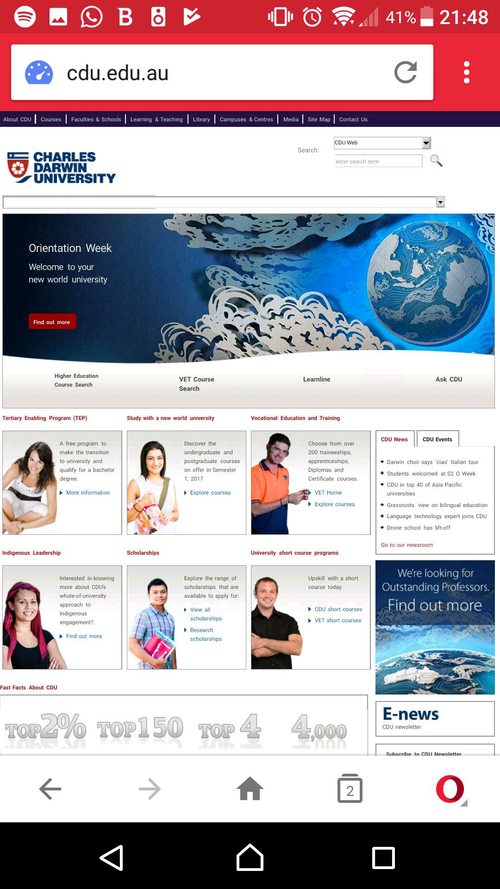

# Not the Wealthy Western Web

## Darwin Web Standards June 2017

### Thanks
* Dash Media
* Charles Darwin University

### Using the internet in the developing world

### The state of the internet
* 1.1 Billion people have access to a broadband network
* 3.5 Billion internet users at the end of 2016
* 5 Billion own mobile phones

	

	

[The state of broadband 2016](http://broadbandcommission.org/Documents/reports/bb-annualreport2016.pdf)

Note:
* World bank claims 1.1 Billion people have access to high speed internet
	* Fixed line DSL, cable, fibre or 4G/LTE
* ITU estimated 3.5 Billion internet users at the end of 2016
* Internet access
	* Only 31% in developing countries
	* 80% in high income countries
* Move evenly spread than income
* Largest number of internet users: China - US - India - Japan - Brazo;

### The developing world

Note:
* 8 in 10 people in the developing world have a mobile phone
* Between 31% (world bank) and 54% (PEW) of people in the developing world have internet access
* Mobiles phones are the main form of internet access
* Mobile use increasing

### The developing world.
* 8 in 10 people in the developing world have a mobile phone
* Between 31% (world bank) and 54% (PEW) of people in the developing world have internet access
* Mobiles phones are the main form of internet access

[World Development Report](http://www.worldbank.org/en/publication/wdr2016)

[PEW Global Internet Usage Annual Survey](http://www.pewglobal.org/2016/02/22/smartphone-ownership-and-internet-usage-continues-to-climb-in-emerging-economies/)

### The developing world.

[World Population](http://www.worldometers.info/world-population/)

Note:
* Over 4 billion people live in Asia
* Over half the global population
* Right on our doorstep

### The developing world.
* Zero rating addresses costs - for services that can afford it
	* Net neutrality advocates oppose zero rating
	* India banned zero rated services last year

### Australia

### Australia
* 37% of remote and regional Australians feel they have good internet access
* 48% report poor access
* 52% report good mobile covereage while 31% report it is poor
* But only 37% use their phone for internet

[UC Study finds Australians feeling good but lack connections](https://www.canberra.edu.au/about-uc/media/media-releases/2016/june/uc-study-finds-regional-australians-feeling-good,-but-lack-connections)

[Better access to high speed broadband for rural and remote health care](https://www.canberra.edu.au/about-uc/media/media-releases/2016/june/uc-study-finds-regional-australians-feeling-good,-but-lack-connections)

## Connection Speeds

## Connection Speeds
* Global average connection speed is 7Mbps
* 26% yearly growth
* But growth is extremly variable
* Average connection speed can be deceptive
* Move meaningful to look at base speeds (e.g. % over 4Mbps) than average speed?

[Acamai state of the internet report 2016](https://www.akamai.com/us/en/multimedia/documents/state-of-the-internet/q4-2016-state-of-the-internet-connectivity-report.pdf)

[freepublicwifi.gov.ph](http://freepublicwifi.gov.ph/)

Note:
* Plenty of reporting on average speeds
* But growth is extremly variable (Vietnam saw 115% while Phillipies saw 44%)
* Average connection speed can be deceptive - in q4 2016 Phillipines was 4.5Mbps but only 31% of the population have access to 4Mbps or above
* Phillipines provide free 512kbps public wifi to get more people online

## Connection Speeds

	

	

## Webpage size
* The average website is now 2.9Mb - 3Mb this year?
* Think about how much needs to be downloaded to render. How much to be functional

[HTTP Archive - Interesting stats](http://www.httparchive.org/interesting.php?a=All&l=May%2015%202017)

Note:
* Average website grew over 1Mb in 2012
* It grew over 2Mb in 2015
* That is 3.314 seconds to download the average page on the average connection
* More than 5.8 seconds for 69% of internet users in the Phillipines

## Latency
* Latency affects each new request
* HTTP/2 Multiplexing addresses a number of issues with this
* A satelite network will likely add >600ms to each RESTful request you make

Note:
* In indonesia I depended on the high latency mobile networks
* HTTP/2 - Less of a concern with multiple images or scripts
* But - there is still a time penalty each time you have to go out to the server
* I can't find data but in 2013 I had regular ping times over 2000ms in regional Indonesia
	* Many server side requests simply timed out

## Latency tips
* The fastest resource is the one you don't download
* Reduce restful requests
* Ensure there is enough data to use in the initial page load
	* Ok to load extra data later - but make sure the page works without it

## Devices
* Phone markets differ around the world
* Smart phones are increasing in popularity but smaller, cheaper phones dominate the emerging markets

[W3Counter global web stats](https://www.w3counter.com/globalstats.php)

Note:
* We're used to designing for mobile but it is worth remembering that a lot of people don't have the types of premium phones we're used to
* 90% of mobile phones sold globally are Android
	* only 52.3% in Australia
	* Higher in price sensitive markets. 97% in India
* Huawei, Oppo and Vivo took 24% of global smartphone sales last quarter

# Devices
* gstats report screen size of 360x640 is the most popular (19.78%) of all traffic they see
	* Indonesia (18.33%), India (19.07%) China (23.93%) and Kenya (9.16%) are consistant with this
	* 1366x768 is the most popular in Australia (10.93%) and Brazil (28.56%)
	* The smaller resolutions are not going anywhere

[Worldwide screen resolution stats](http://gs.statcounter.com/screen-resolution-stats)

Note:
* Many users have phones with much smaller resolutions than those you likely use for testing
	* I couldn't find data on this but they may not have as reliable sensor data as the devices you are used to either
	* Also may not support faster mobile networks
* gstats report a global increase in the smaller resolution over the past year

## Cost
* Internet costs vary wildly around the world
* A 2500kb site costs
	* $0.21 USD in Brazil
	* $0.04 USD in Australia
	* $0.02 USD in the Phillipines
	* $0.01 USD in India and Indonesia
* Lower cost is not always cheaper
	* Economic differences mean a lower cost is still expensive for locals on lower incomes

[What does my site cost?](https://whatdoesmysitecost.com/)

[The cost of internet around the world](https://valme.io/c/technology/vkqqs/the-cost-to-connect-internet-prices-around-the-world)

[Price rankings by country](https://www.numbeo.com/cost-of-living/country_price_rankings?itemId=33)

[The cost to connect](https://valme.io/c/technology/vkqqs/the-cost-to-connect-internet-prices-around-the-world)

## Proxy Browsers
* Not just a relic from the past
* Great for poor internet connections
	* Websites are cached on an intermediary server
	* Render and optimise on webpages to reduce loading time
	* This can mean pages render differently and have unexpected performance
	* Regularly changing is not well suited to proxy browsers

[GS Stats Counter](http://gs.statcounter.com/)

[CanIUse browser usage table](http://caniuse.com/usage-table)

[Wikipedia: UC Browser](https://en.wikipedia.org/wiki/UC_Browser)

Note:
* StatCounter Global Stats reports UC Browser has 8.4% of traffic in May 2017
* Opera Mini 2.8%
* Huge usage in China, India and Indonesia
* Pages can be cached and out of date
* Loading new can be slower due to the two steps between the client and proxy, and proxy and server

## Proxy Browser Limitations
* Javascript can be cut to improve performance
* CSS may not render properly
* Limited animation

Note:
* Opera mini can throttle javascript after a few seconds to improve performance

## Proxy Browsers

## Solutions
* Progressive Web Apps - not native apps
* Use service workers
* Responsive images
* Send all data you *need* in initial request
	* Ok to load data from the server later - but the page should work without it
* Keep an eye on ads - They can get *big*

Note:
* Progressive web apps are smaller, have wider support and can still be installed like an app with a manifest
* Service workers can be used to prefetch cache to reduce loading time and to work offline. But it is important not to prefetch anything that is not absolutely required
* Proxy browsers may mean you don't have working javascript - if this is a concern treat javascript as an enhancement
* Don't require javascript on load

## Tools
* Throttling on Chrome
* Server side rendering

## References

[page load times in different countries](https://discussion.dreamhost.com/thread-130711.html)

[performance and network segmentation on android](https://code.facebook.com/posts/952628711437136/classes-performance-and-network-segmentation-on-android/)

[IDG](http://www.itu.int/en/Pages/default.aspx)

